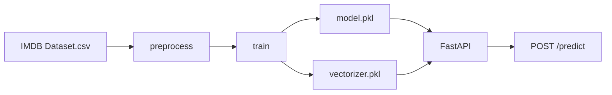

[English](README.md) | [Русский](README.ru.md)

# IMDB Sentiment Analysis


IMDB review sentiment classification: from EDA and text cleaning to TF-IDF, logistic regression, and an HTTP API.

## About

The project predicts review sentiment (`positive` / `negative`) from the review text.

The dataset is [IMDB Dataset of 50K Movie Reviews](https://www.kaggle.com/datasets/lakshmi25npathi/imdb-dataset-of-50k-movie-reviews) on Kaggle (`lakshmi25npathi/imdb-dataset-of-50k-movie-reviews`): **50,000** reviews and two columns, `review` and `sentiment`. Classes in the raw data are balanced.

The goal is a reproducible pipeline: download → text cleaning → Logistic Regression + TF-IDF → artifacts → FastAPI inference.

## Results

Hold-out: `test_size=0.8`, `random_state=42`, `stratify` (20% of the data for training, 80% for test). The comparison metric is **f1_macro** of the best MLflow trials (Optuna, 30 runs per setting).

Three settings:

- **Balanced** — original train, no `class_weight`
- **Imbalanced, no fix** — `make_disbalance` (`pos_ratio=0.1`), no compensation
- **Imbalanced, with a fix** — the same skewed train; LogReg and LinearSVC use `class_weight="balanced"`, MultinomialNB uses `fit_prior=False`

| Model | Balanced | Imbalanced, no fix | Imbalanced, with a fix |
| --- | ---: | ---: | ---: |
| **Logistic Regression** (in the service) | 0.8848 | 0.4274 | **0.8251** |
| LinearSVC | **0.8930** | 0.6572 | 0.7702 |
| MultinomialNB | 0.8693 | 0.7017 | 0.7437 |

The production model is not the strongest one on balanced data. It is **Logistic Regression** with `class_weight="balanced"`. On a balanced train it is a bit weaker than the best SVC, but on a skewed sample it does not collapse the way the unfixed run does (0.43 vs 0.83).

A rerun of this setup inside the Docker image gives f1_macro ≈ **0.874**.

The best LogReg n-gram ranges on balanced data are almost the same: `(1, 1)` — 0.8776, `(1, 2)` — 0.8837, `(1, 3)` — 0.8848.

## Why these choices

**N-grams.** "Trigrams are not worth it, given the zero difference." Production uses `(1, 2)`: "Optuna picked `(1, 1)`, but that is within the noise." Bigrams and trigrams differ by about 0.001 f1_macro, so the cheaper `(1, 2)` went into the service.

**Punctuation and digits.** "Removing punctuation may not change the outcome much... with TF-IDF it does not matter that much, because we are not doing semantics." For classical ML, tags, punctuation, and digits are stripped. A transformer would be a reason to keep them.

**Imbalance and `class_weight`.** "A loss of 0.06 is worth it so that an unexpected imbalance does not cost 0.12 later. The chance of imbalance is high enough to pay a 0.06 tax and avoid a surprise 0.12 penalty." That is why the service uses LogReg with `class_weight="balanced"`, even if it is not the top of the table on a balanced set.

Final model parameters: `C=0.5`, `max_iter=1000`, `class_weight="balanced"`, TF-IDF `min_df=5`, `max_df=0.95`, `sublinear_tf=True`, `ngram_range=(1, 2)`, `max_features=40000`.

## Architecture

```text
Kaggle CSV
    → src/data_download.py   download IMDB via kagglehub
    → src/preprocess.py      strip HTML/tags, encode sentiment
    → src/train.py           TF-IDF + Logistic Regression
    → model/*.pkl            model.pkl, vectorizer.pkl
    → FastAPI /predict       Positive / Negative and model confidence
```



## Stack

- **Python** 3.12, pandas, numpy
- **scikit-learn** — TF-IDF, Logistic Regression, LinearSVC, MultinomialNB
- **Optuna** — hyperparameter search (in the notebook)
- **MLflow** — experiment logs and balance-setting comparison
- **kagglehub** — dataset download
- **FastAPI + uvicorn + pydantic** — HTTP API
- **joblib** — model and vectorizer serialization
- **Docker** — `python:3.12-slim`; the image downloads the dataset, trains LogReg, and serves the API
- **pytest** — request/response schemas and HTML cleaning

## Project layout

```text
IMDB_NLP_ML/
├── app/                  FastAPI service
│   ├── main.py           /health, /predict
│   ├── schemas.py        pydantic request and response schemas
│   └── model_loader.py   load pkl files on startup
├── src/
│   ├── data_download.py  download the CSV from Kaggle
│   ├── preprocess.py     EDA, cleaning, split, make_disbalance
│   └── train.py          train LogReg and save artifacts
├── test/
│   └── test.py           pytest
├── data/                 raw dataset (not in git)
├── model/                model.pkl, vectorizer.pkl (not in git)
├── notebook/             original experiments
├── report/
├── Dockerfile
├── .dockerignore
├── requirements.txt
├── README.md
└── README.ru.md
```

CSV and `.pkl` files are not committed. The dataset is downloaded from Kaggle, and the model is built with `python -m src.train` or during `docker build`.

## How to run

### Locally

You need Python 3.12 and Kaggle access (kagglehub), or place `IMDB Dataset.csv` in `data/`.

```bash
python -m venv .venv
source .venv/bin/activate
pip install -r requirements.txt

python -m src.train          # metrics + model/model.pkl and model/vectorizer.pkl
python -m app.main           # API at http://127.0.0.1:8000
```

Without activating the venv:

```bash
.venv/bin/python -m src.train
.venv/bin/python -m app.main
```

Swagger UI: [http://127.0.0.1:8000/docs](http://127.0.0.1:8000/docs)

### Tests

```bash
PYTHONPATH=. python -m pytest test/test.py -v
```

The tests check the request schema, the response schema, and HTML tag cleaning in a review.

### Docker

The build downloads the dataset from Kaggle, trains Logistic Regression inside the image, and stores `model/*.pkl` there. The first `docker build` takes several minutes.

```bash
docker build -t imdb-nlp-ml .
docker run --rm -p 8000:8000 imdb-nlp-ml
```

API: [http://127.0.0.1:8000](http://127.0.0.1:8000), Swagger: [http://127.0.0.1:8000/docs](http://127.0.0.1:8000/docs).

Check: `GET /health` → `{"status":"healthy"}`. LogReg in the built image reaches f1_macro ≈ 0.874.

## API

- `GET /health` — the service is up and the model plus vectorizer are loaded
- `POST /predict` — sentiment (`Positive` / `Negative`) and model confidence
- Interactive schema: `/docs` (Swagger)

Example request:

```bash
curl -X POST http://127.0.0.1:8000/predict \
  -H "Content-Type: application/json" \
  -d '{"review": "This movie was absolutely wonderful and thrilling!"}'
```

Example response:

```json
{
  "predicted_sentiement": "Positive",
  "predicted_proba_sentiement": "0.61"
}
```

`review` is the raw review text. The same cleaning used in training is applied before prediction.

## What to improve

- Broader test coverage: the API, the Docker image contract, and edge cases in text cleaning
- Cross-validation instead of a single hold-out (Optuna currently scores the same test set)
- More work on n-grams: check whether trigrams help on the other models and on a skewed sample
- docker-compose, so the `docker run` flags do not have to be remembered
- Model artifact versioning

## Author

**Ilya Ryabets** — [GitHub](https://github.com/ng0q) · [Email](mailto:ilyaryabes71@gmail.com)

SibSUTIS student, Software Development for Automated Systems.
