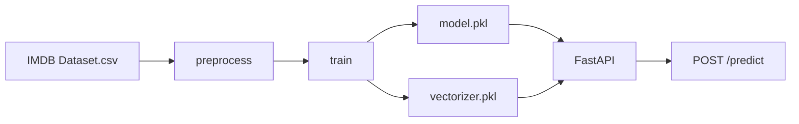

[English](README.md) | [Русский](README.ru.md)

# IMDB Sentiment Analysis


Классификация тональности отзывов IMDB: от EDA и очистки текста до TF-IDF, логистической регрессии и HTTP API.

## О проекте

Проект предсказывает тональность отзыва (`positive` / `negative`) по тексту рецензии.

Датасет — [IMDB Dataset of 50K Movie Reviews](https://www.kaggle.com/datasets/lakshmi25npathi/imdb-dataset-of-50k-movie-reviews) на Kaggle (`lakshmi25npathi/imdb-dataset-of-50k-movie-reviews`): **50 000** отзывов и две колонки, `review` и `sentiment`. Классы в сырых данных сбалансированы.

Цель — воспроизводимый пайплайн: скачивание → очистка текста → обучение Logistic Regression + TF-IDF → артефакты → FastAPI для инференса.

Исходные эксперименты лежат в [`notebook/nlpai.ipynb`](notebook/nlpai.ipynb).

## Результаты

Hold-out: `test_size=0.8`, `random_state=42`, `stratify` (в обучении 20% выборки, в тесте 80%). Такой маленький train взят специально: это проба на маленькой выборке, а не обычное деление 75/25. Метрика сравнения — **f1_macro** лучших trial из MLflow (Optuna, 30 прогонов на режим).

Три режима:

- **Баланс** — исходный train, без `class_weight`
- **Дисбаланс без борьбы** — `make_disbalance` (`pos_ratio=0.1`), без компенсации
- **Дисбаланс с борьбой** — тот же скошенный train; у LogReg и LinearSVC `class_weight="balanced"`, у MultinomialNB `fit_prior=False`

| Модель | Баланс | Дисбаланс без борьбы | Дисбаланс с борьбой |
| --- | ---: | ---: | ---: |
| **Logistic Regression** (в сервисе) | 0.8848 | 0.4274 | **0.8251** |
| LinearSVC | **0.8930** | 0.6572 | 0.7702 |
| MultinomialNB | 0.8693 | 0.7017 | 0.7437 |

В прод ушла не самая сильная модель на балансе, а **Logistic Regression** с `class_weight="balanced"`. На сбалансированном train она чуть слабее лучшего SVC, зато на скошенной выборке не проваливается так, как вариант без борьбы (0.43 против 0.83).

Повторный прогон этой конфигурации в Docker-образе даёт f1_macro ≈ **0.874**.

Лучшие n-граммы LogReg на балансе почти совпали: `(1, 1)` — 0.8776, `(1, 2)` — 0.8837, `(1, 3)` — 0.8848.

## Почему такие решения

**N-граммы.** «Триграммы того не стоят, учитывая нулевую разницу». Для продакшена зафиксирован диапазон `(1, 2)`: «Optuna выбрала `(1, 1)`, но это в пределах шума». Биграммы и триграммы отличаются на ~0.001 f1_macro, поэтому в сервис пошёл более дешёвый `(1, 2)`.

**Пунктуация и цифры.** «Удаление пунктуации может не очень сказаться на итоге... в рамках TF-IDF это всё не так важно, ведь мы не занимаемся семантикой». Для классического ML теги, знаки и цифры вычищаются; для трансформера их стоило бы оставить.

**Дисбаланс и `class_weight`.** «Проигрыш в 0.06 стоит того, чтобы потом на неожиданном дисбалансе не проиграть 0.12. Шанс дисбаланса явно достаточен, чтобы заплатить налог в 0.06, чтобы не получить потом неожиданный штраф в 0.12». Поэтому в сервисе LogReg с `class_weight="balanced"`, даже если на ровной выборке это не максимум таблицы.

Параметры итоговой модели: `C=0.5`, `max_iter=1000`, `class_weight="balanced"`, TF-IDF `min_df=5`, `max_df=0.95`, `sublinear_tf=True`, `ngram_range=(1, 2)`, `max_features=40000`.

## Архитектура

```text
Kaggle CSV
    → src/data_download.py   скачивание IMDB через kagglehub
    → src/preprocess.py      очистка HTML/тегов, кодирование sentiment
    → src/train.py           TF-IDF + Logistic Regression
    → model/*.pkl            model.pkl, vectorizer.pkl
    → FastAPI /predict       Positive / Negative и уверенность модели
```



## Стек

- **Python** 3.12, pandas, numpy
- **scikit-learn** — TF-IDF, Logistic Regression, LinearSVC, MultinomialNB
- **Optuna** — подбор гиперпараметров (в ноутбуке)
- **MLflow** — логи экспериментов, сравнение режимов баланса
- **kagglehub** — скачивание датасета
- **FastAPI + uvicorn + pydantic** — HTTP API
- **joblib** — сериализация модели и векторизатора
- **Docker** — `python:3.12-slim`, при сборке качает датасет, обучает LogReg и поднимает API
- **pytest** — схемы запроса/ответа и очистка HTML в тексте

## Структура проекта

```text
IMDB_NLP_ML/
├── app/                  FastAPI-сервис
│   ├── main.py           /health, /predict
│   ├── schemas.py        pydantic-схемы запроса и ответа
│   └── model_loader.py   загрузка pkl при старте
├── src/
│   ├── data_download.py  скачивание CSV с Kaggle
│   ├── preprocess.py     EDA, очистка, split, make_disbalance
│   └── train.py          обучение LogReg и сохранение артефактов
├── test/
│   └── test.py           pytest
├── data/                 сырой датасет (не в git)
├── model/                model.pkl, vectorizer.pkl (не в git)
├── notebook/
│   └── nlpai.ipynb       исходные эксперименты
├── report/
├── Dockerfile
├── .dockerignore
├── requirements.txt
├── LICENSE
├── README.md
└── README.ru.md
```

CSV и `.pkl` в git не коммитятся: датасет качается с Kaggle, модель собирается через `python -m src.train` или при `docker build`.

## Как запустить

### Локально

Нужны Python 3.12 и доступ к Kaggle (kagglehub). Либо положите `IMDB Dataset.csv` в `data/`.

```bash
python -m venv .venv
source .venv/bin/activate
pip install -r requirements.txt

python -m src.train          # метрики + model/model.pkl и model/vectorizer.pkl
python -m app.main           # API на http://127.0.0.1:8000
```

Без активации venv:

```bash
.venv/bin/python -m src.train
.venv/bin/python -m app.main
```

Swagger UI: [http://127.0.0.1:8000/docs](http://127.0.0.1:8000/docs)

### Тесты

```bash
PYTHONPATH=. python -m pytest test/test.py -v
```

Проверяются схема запроса, схема ответа и очистка HTML-тегов в отзыве.

### Через Docker

Сборка качает датасет с Kaggle, обучает Logistic Regression внутри образа и кладёт `model/*.pkl` туда же. Первый `docker build` занимает несколько минут.

```bash
docker build -t imdb-nlp-ml .
docker run --rm -p 8000:8000 imdb-nlp-ml
```

API: [http://127.0.0.1:8000](http://127.0.0.1:8000), Swagger: [http://127.0.0.1:8000/docs](http://127.0.0.1:8000/docs).

Проверка: `GET /health` → `{"status":"healthy"}`. В собранном образе LogReg даёт f1_macro ≈ 0.874.

## API

- `GET /health` — сервис жив и модель с векторизатором загружены
- `POST /predict` — тональность (`Positive` / `Negative`) и уверенность модели
- Интерактивная схема: `/docs` (Swagger)

Пример запроса:

```bash
curl -X POST http://127.0.0.1:8000/predict \
  -H "Content-Type: application/json" \
  -d '{"review": "This movie was absolutely wonderful and thrilling!"}'
```

Пример ответа:

```json
{
  "predicted_sentiment": "Positive",
  "predicted_proba_sentiment": "0.61"
}
```

Поле `review` — сырой текст отзыва. Перед предсказанием к нему применяется та же очистка, что и при обучении.

## Что можно улучшить

- Более широкое покрытие тестами: API, контракт Docker-образа, крайние случаи очистки текста
- Кросс-валидация вместо одного hold-out (сейчас Optuna смотрела на тот же test)
- Чуть больше работы с n-граммами: отдельно проверить, есть ли выгода у триграмм на других моделях и на скошенной выборке
- docker-compose, чтобы не помнить флаги `docker run`
- Версионирование артефактов модели

## Лицензия

[MIT](LICENSE) © 2026 Илья Рябец.

## Автор

**Илья Рябец** — [GitHub](https://github.com/ng0q) · [Email](mailto:ilyaryabes71@gmail.com)

Студент СибГУТИ, специальность «Разработка ПО для автоматизированных систем».
